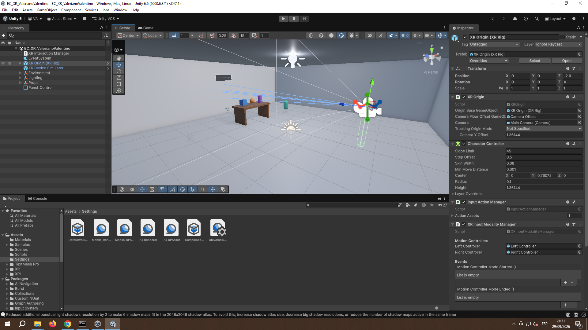
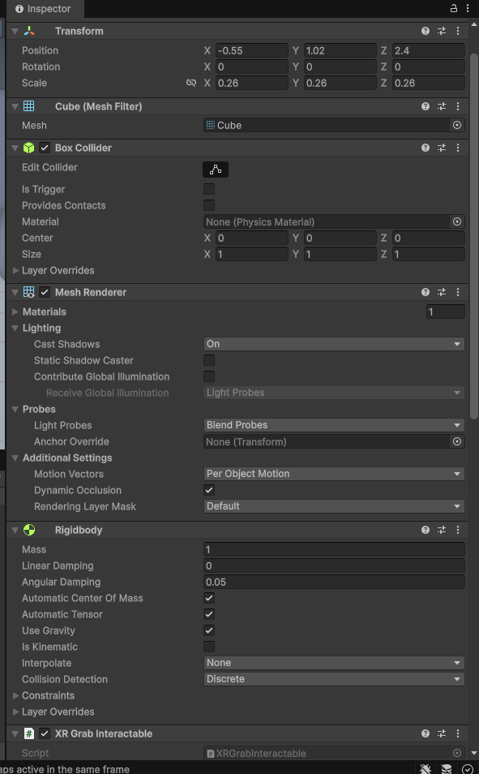
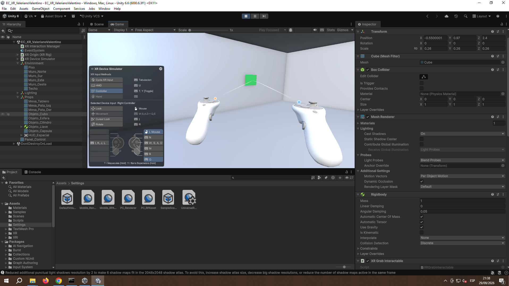
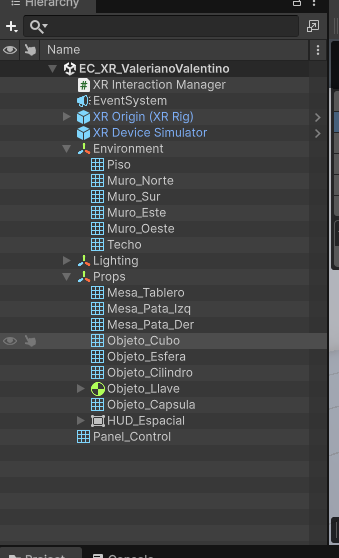
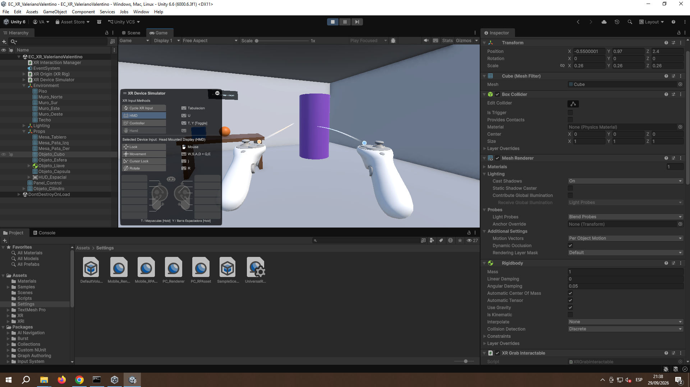

# EC XR Interaction Challenge

Experiencia interactiva de **Realidad Extendida (XR)** desarrollada en **Unity 6** como
Evaluación de Conocimientos del curso *Laboratorio de Realidad Extendida (XR) para Videojuegos*.

El proyecto consiste en una pequeña **sala de entrenamiento XR**: un entorno tridimensional con
piso, muros, iluminación y objetos manipulables, en el que el usuario se desplaza en primera
persona, **agarra objetos**, **interactúa a distancia mediante un rayo** y **se teletransporta**
por el escenario.

---

## 1. Datos del estudiante

| Campo | Valor |
|---|---|
| **Apellidos y nombres** | Valeriano Alarcon, Valentino Samir |
| **Código de estudiante** | 223189147 |
| **Curso** | Laboratorio de Realidad Extendida (XR) para Videojuegos |
| **Docente** | Víctor Alejandro Arroyo Castro |
| **Institución** | Universidad Autónoma del Perú — Facultad de Ingeniería y Arquitectura |

---

## 2. Descripción del proyecto

**EC XR Interaction Challenge** es una escena de entrenamiento XR ambientada en una sala cerrada.
El objetivo es demostrar la correcta **configuración de un proyecto XR en Unity** (URP + XR
Plug-in Management + OpenXR + XR Interaction Toolkit) y el funcionamiento de las **interacciones
básicas** del XR Interaction Toolkit:

- **Manipulación directa**: el usuario agarra y suelta objetos con las manos virtuales.
- **Interacción a distancia**: mediante un rayo, el usuario acciona un panel de control que
  enciende y apaga la luz de la sala y cambia el color de un objeto.
- **Locomoción**: teletransporte sobre el piso de la sala y desplazamiento continuo.

La experiencia está pensada para ejecutarse **en el Editor con el XR Device Simulator** (sin
necesidad de un visor) o en un dispositivo XR compatible con OpenXR.

### Estructura del escenario

```
Sala de entrenamiento (10 x 10 unidades)
├── Piso con TeleportationArea
├── 4 muros + techo (límites visuales)
├── Iluminación: luz direccional + luz de sala (conmutable) + luz de acento
├── Mesa de trabajo
├── 6 objetos 3D
│   ├── Objeto_Cubo        (agarrable)
│   ├── Objeto_Esfera      (agarrable)
│   ├── Objeto_Cilindro    (agarrable)
│   ├── Objeto_Llave       (agarrable — herramienta compuesta)
│   ├── Objeto_Capsula     (cambia de color con el panel)
│   └── Mesa / patas       (estáticos)
├── Panel_Control          (XRSimpleInteractable — interacción por rayo)
└── HUD_Espacial           (contador en Canvas World Space)
```

---

## 3. Funcionalidades implementadas

| # | Funcionalidad | Implementación | Puntos |
|---|---|---|---|
| 1 | **Configuración del proyecto XR** | Unity 6 + **URP** + XR Plug-in Management con **OpenXR** | 4 |
| 2 | **Escenario XR** | Escena `EC_XR_ValerianoValentino`, piso, iluminación, límites visuales y **6 objetos 3D** | 3 |
| 3 | **Interacción con objetos** | **4 objetos manipulables** con `Rigidbody` + `XRGrabInteractable` (cubo, esfera, cilindro y llave) | 5 |
| 4 | **Interacción a distancia** | `XRRayInteractor` + `XRSimpleInteractable` → el **Panel de Control** enciende/apaga la luz de la sala y cambia el color de la cápsula | 3 |
| 5 | **Reto libre** | **Teletransporte** (`TeleportationArea` + `TeleportationProvider`) y **contador de objetos agarrados** en UI espacial | 2 |
| 6 | **GitHub + documentación** | Este README + repositorio público | 3 |

### Detalle de las interacciones

- **Agarre (grab)**: los objetos `Objeto_Cubo`, `Objeto_Esfera`, `Objeto_Cilindro` y
  `Objeto_Llave` tienen `Rigidbody` y `XRGrabInteractable`; se pueden levantar, mover, soltar y
  **lanzar** (`Throw On Detach` activado por defecto).
- **Interacción a distancia (rayo)**: apuntando con el rayo del mando derecho al `Panel_Control`
  y accionando el gatillo, se conmuta el estado del panel: la **luz de sala** se enciende o apaga
  y la **cápsula** cambia entre su color base y el material verde emisivo.
- **Teletransporte**: el `TeleportationArea` del piso permite desplazarse a cualquier punto de la
  sala apuntando con el rayo.
- **Contador (UI espacial)**: un `Canvas` en *World Space* muestra `Objetos agarrados: N / 4` y
  se actualiza cada vez que se agarra un objeto nuevo.

---

## 4. Controles e instrucciones de uso

### Ejecutar en el Editor (sin visor XR)

1. Abrir el proyecto con **Unity 6000.6.3f1**.
2. Abrir la escena `Assets/Scenes/EC_XR_ValerianoValentino.unity`.
3. Pulsar **Play**.
4. Controlar con el **XR Device Simulator** incluido en la escena.

| Acción | Tecla / Ratón |
|---|---|
| **Caminar (mueve cámara y manos juntas)** | **`W` `A` `S` `D`** |
| Mirar alrededor | **mover el ratón** (sin pulsar nada) |
| **AGARRAR un objeto / accionar el Panel de Control** | **Clic izquierdo** (o **`G`**) |
| Soltar el objeto | soltar el clic izquierdo |
| Lanzar el objeto | soltarlo mientras mueves el brazo |
| **Teletransportarse** | apuntar con el rayo al **Piso** y soltar |
| Manipular mando derecho (MANTENER) | `Espacio` |
| Manipular mando izquierdo (MANTENER) | `Shift izquierdo` |
| Fijar / liberar mando derecho | `Y` (toggle) |
| Fijar / liberar mando izquierdo | `T` (toggle) |
| Botón primario | `B` |
| Cambiar de dispositivo (izq./der./HMD) | `Tab` |

> ℹ️ **Detalle técnico importante:** en los *Starter Assets* del XR Interaction Toolkit la acción
> **`Select`** (agarrar) está ligada a `<XRController>/{GripButton}`, **no** al gatillo. El gatillo
> dispara la acción **`Activate`**. Por eso este proyecto vincula `<Mouse>/leftButton` tanto al
> `Grip` como a `Manipulate Right`: un clic izquierdo agarra directamente, sin mantener `Espacio`.
>
> Si alguna vez parte de un proyecto limpio sin esos bindings, la forma estándar es
> **mantener `Espacio`** (manipular mando derecho) y **pulsar `G`** (grip) para agarrar.


> ⚠️ **No uses la tecla `3`**: activa el modo "posición del dispositivo", que traslada
> **solo la cabeza** y hace que las manos se queden atrás. Déjalo en el modo por defecto (`1`).


### Ejecutar en un dispositivo XR

1. Conectar el visor compatible con **OpenXR**.
2. En `Edit > Project Settings > XR Plug-in Management > OpenXR`, ajustar el *Interaction Profile*
   del visor si es necesario.
3. **Desactivar** `Mock Runtime` en `OpenXR > Feature Groups`.
4. Pulsar **Play** o compilar desde `File > Build Settings`.

---

## 5. Capturas de pantalla

### (1) Vista general del escenario



Vista de la sala de entrenamiento en la **Scene view**: piso, cuatro muros, techo, iluminación
(direccional + dos puntuales), mesa de trabajo y los objetos 3D. A la derecha, el Inspector del
`XR Origin (XR Rig)` mostrando los componentes `XROrigin`, `Input Action Manager` y
`XR Input Modality Manager`.

### (2) Configuración XR / componentes en el Inspector



Inspector de `Props ▸ Objeto_Cubo`: **`Rigidbody`** (con `Use Gravity`) y
**`XR Grab Interactable`**, los dos componentes que hacen que el objeto sea manipulable.
La configuración de XR Plug-in Management (OpenXR + 9 perfiles de interacción en Android,
XR Device Simulator en el Editor) se describe en la sección 7.

### (3) Una interacción funcionando



**Play mode.** El rayo del mando derecho apunta al `Panel_Control`, que está **en verde**
(estado *encendido*): la interacción a distancia ha activado la luz de sala y ha cambiado el
material del panel. Se ve también la UI del **XR Device Simulator** con el mando derecho
seleccionado.

### (4) Estructura de la escena



Jerarquía completa: `XR Interaction Manager`, `EventSystem`, `XR Origin (XR Rig)`,
`XR Device Simulator`, `Environment`, `Lighting`, `Props` y `Panel_Control`.

### (5) Agarre de objetos



**Play mode.** El cilindro agarrado y sostenido con el mando; el `XRGrabInteractable` responde al
grip y el contador del HUD espacial registra la parada.

> **Nota:** todas las capturas están en la carpeta `docs/screenshots/` del repositorio.

---

## 6. Video demostrativo

**Duración: 28,5 segundos** (dentro del máximo de 1 minuto).

**Enlace al video:**

- En el repositorio: [`docs/video/EC_XR_ValerianoValentino.mp4`](docs/video/EC_XR_ValerianoValentino.mp4)
- Enlace directo web: <https://github.com/ImBoolean-2/EC_XR_ValerianoValentino/blob/main/docs/video/EC_XR_ValerianoValentino.mp4>

### Contenido del video

| Momento | Qué muestra |
|---|---|
| Inicio | Vista general de la sala de entrenamiento |
| Desarrollo | Agarre y manipulación de objetos con el mando |
| Desarrollo | Interacción a distancia: el rayo acciona el `Panel_Control` (luz y color) |
| Desarrollo | Teletransporte por el escenario |
| Cierre | Contador de objetos agarrados en la UI espacial |

### Guion (por si se vuelve a grabar)

1. **0:00 – 0:10** — Vista general de la escena y del proyecto abierto en Unity.
2. **0:10 – 0:25** — Agarrar, mover y lanzar el cubo y la esfera (interacción con objetos).
3. **0:25 – 0:40** — Interacción a distancia: apuntar al panel y encender/apagar la luz.
4. **0:40 – 0:55** — Teletransporte por la sala y contador de agarres actualizándose.
5. **0:55 – 1:00** — Inspector mostrando los componentes XR.

---

## 7. Tecnologías y paquetes utilizados

| Elemento | Versión |
|---|---|
| **Unity Editor** | 6000.6.3f1 (Unity 6) |
| **Universal Render Pipeline (URP)** | 17.6.0 |
| **XR Interaction Toolkit (XRI)** | 3.6.1 |
| **XR Plug-in Management** | 4.5.4 |
| **OpenXR Plugin** | 1.17.1 |
| **XR Core Utilities** | 2.6.0 |
| **Input System** | 1.20.0 |
| **uGUI** | 2.6.0 |
| **Lenguaje** | C# |
| **Control de versiones** | Git + GitHub |

### Componentes XR utilizados

- `XR Origin (XR Rig)` (Starter Assets del XR Interaction Toolkit)
- `XR Interaction Manager`
- `XRGrabInteractable` + `Rigidbody`
- `XRRayInteractor` / `XRSimpleInteractable`
- `TeleportationArea` + `TeleportationProvider`
- `XRUIInputModule`
- `XR Device Simulator` (pruebas sin visor)

### Configuración XR por plataforma

| Plataforma | Proveedor XR | Motivo |
|---|---|---|
| **Android (Quest)** | **OpenXR** + 9 perfiles de interacción activos | Plataforma objetivo real de una experiencia XR |
| **Standalone / PC (Editor)** | **XR Device Simulator** (sin proveedor OpenXR) | Unity documenta que el XR Device Simulator es **incompatible con OpenXR**: el HMD que crea el runtime compite con el HMD simulado y el rig XR acaba leyendo los dispositivos equivocados (síntoma: la cámara se movía y los mandos no). |

> Para probar en PC con un visor real: `Project Settings ▸ XR Plug-in Management` → pestaña de
> escritorio → activar **OpenXR**, añadir el *Interaction Profile* del visor y **quitar** el
> `XR Device Simulator` de la escena.

### Nota sobre un aviso de consola (esperado y benigno)

Al ejecutar en el Editor puede aparecer:

```
Failed to get haptic capabilities of XRSimulatedController ... error code -1.
Continuing assuming a single haptic channel.
```

Es un aviso **informativo** del XR Interaction Toolkit: los mandos simulados no implementan la
consulta de capacidades hápticas, y el propio mensaje indica que XRI continúa con un canal por
defecto. No afecta a ninguna funcionalidad. El script `Assets/Scripts/SupresorAvisoHaptica.cs`
lo filtra en el Editor para mantener la consola limpia; en un dispositivo real con mandos
físicos no aparece.

---

## 8. Cómo abrir el proyecto

1. Clonar el repositorio:

   ```bash
   git clone https://github.com/ImBoolean-2/EC_XR_ValerianoValentino.git
   ```

2. Abrir **Unity Hub** → `Add` → `Add project from disk` → seleccionar la carpeta clonada.
3. Abrir con **Unity 6000.6.3f1** (la primera importación descarga los paquetes; requiere internet).
4. Abrir `Assets/Scenes/EC_XR_ValerianoValentino.unity` y pulsar **Play**.

> La carpeta `Library/` no se versiona (es regenerable por Unity). Si Unity pide reimportar al
> abrir por primera vez, es el comportamiento esperado.

---

## 9. Repositorio

**Enlace directo:** <https://github.com/ImBoolean-2/EC_XR_ValerianoValentino>

Repositorio **público**. Si no puede accederse sin iniciar sesión, por favor comuníquelo para
corregir la visibilidad.
